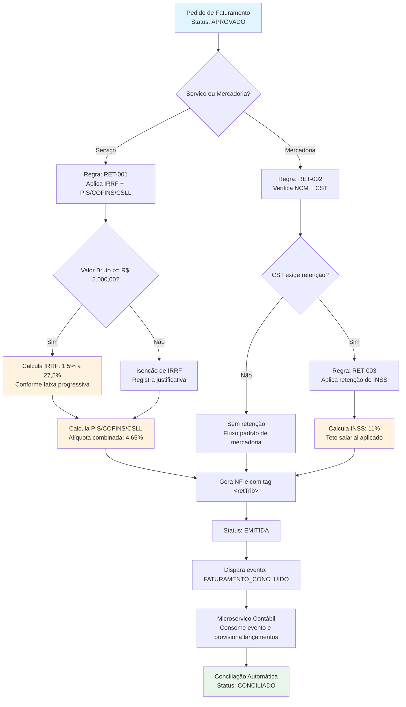

# Módulo 01 — Regras de Negócio: Faturamento com Retenção de Impostos

> **Escopo:** Documentação técnica de arquitetura para sistemas ERP Enterprise com operações fiscais complexas.
> **Público-alvo:** Desenvolvedores Back-end, Analistas de QA, Arquitetos de Software, Analistas Fiscais.
> **Versão:** 1.2.0 | **Última atualização:** 2026-05-29 | **Owner:** Alexandre Claudino

---

## 1. Contexto de Negócio

Em operações B2B de alto ticket, o faturamento não se resume à emissão de uma Nota Fiscal. A legislação brasileira impõe regras de **retenção na fonte** (IRRF, PIS, COFINS, CSLL, INSS) que devem ser calculadas, provisionadas e reconciliadas antes mesmo da emissão do documento fiscal.

> [!IMPORTANT]
> A não conformidade nas regras de retenção gera multas que podem alcançar **20% do valor do tributo omitido**, além de impedimento de operação junto à Receita Federal (CADIN).

---

## 2. Diagrama de Fluxo — Ciclo de Vida do Faturamento com Retenção

O diagrama abaixo representa o fluxo completo desde a geração do pedido de faturamento até a conciliação contábil, incluindo os pontos de decisão críticos para aplicação de retenções.



---

## 3. Matriz de Regras de Validação

Cada regra possui um ID único, critérios de entrada, algoritmo de cálculo e cenários de teste associados. Esta matriz serve como **fonte única da verdade** para desenvolvedores e QAs.

| ID da Regra | Nome | Tipo de Operação | Gatilho | Algoritmo / Fórmula | Status |
|:---|:---|:---|:---|:---|:---|
| **RET-001** | Retenção de IRRF sobre Serviços | Serviço (RPS) | Valor bruto do serviço | `IRRF = valor_bruto * aliquota_faixa` — faixa progressiva conforme tabela mensal da Receita | ✅ Ativo |
| **RET-002** | Verificação de NCM para Retenção | Mercadoria (NF-e) | Código NCM do item | Consulta tabela `ncm_retencao` (cache Redis, TTL 24h). Se `ind_retencao = 'S'`, aplica RET-003 | ✅ Ativo |
| **RET-003** | Retenção de INSS sobre Mercadoria | Mercadoria (NF-e) | CST = 900 (Outras) + NCM retentivo | `INSS = min(valor_base * 0.11, teto_inss_mensal)` — teto atualizado via API INSS mensalmente | ✅ Ativo |
| **RET-004** | Retenção de PIS/COFINS/CSLL | Serviço (RPS) | Valor bruto >= R$ 5.000,00 | `PIS = base * 0.0065` / `COFINS = base * 0.03` / `CSLL = base * 0.01` | ✅ Ativo |
| **RET-005** | Isenção de IRRF — Valor abaixo do limite | Serviço (RPS) | Valor bruto < R$ 5.000,00 | Registra justificativa `cod_motivo = 001` em `log_retencao` para auditoria | ✅ Ativo |
| **RET-006** | Rateio de Retenções em Notas de Crédito | Nota de Crédito | Nota de origem possui retenções | Proporcionaliza valores retidos com base no percentual de crédito aplicado | 🔄 Em revisão |

---

## 4. Notas Críticas de Arquitetura

> [!WARNING]
> As decisões de arquitetura abaixo impactam diretamente a consistência fiscal e a performance do sistema em picos de faturamento (ex: fechamento mensal).

### 4.1. Idempotência no Cálculo de Retenções

O cálculo de retenções deve ser **idempotente** por natureza. Uma mesma NF não pode gerar valores de retenção distintos em reprocessamentos.

```java
// Exemplo: Garantia de idempotência via hash determinístico
String chaveIdempotencia = Hashing.sha256()
    .hashString(pedidoId + "|" + valorBruto + "|" + dataCompetencia, StandardCharsets.UTF_8)
    .toString();

// Cache distribuído (Redis) com TTL de 7 dias
RetencaoCalculada retencao = cacheRetencao.get(chaveIdempotencia);
if (retencao == null) {
    retencao = calculadoraRetencao.calcular(pedido);
    cacheRetencao.put(chaveIdempotencia, retencao, Duration.ofDays(7));
}
```

### 4.2. Event Sourcing para Rastreabilidade Fiscal

Toda alteração em valores de retenção (correções manuais, ajustes de alíquota) deve ser persistida como evento imutável na tabela `evento_retencao`. Isso garante:

- **Auditoria completa** para fiscalização da Receita Federal;
- **Replays seguros** em caso de migração de dados;
- **Compliance** com LGPD (art. 46 — registros de operações).

### 4.3. Separação de Responsabilidades (Bounded Contexts)

| Contexto Delimitado | Responsabilidade | Tecnologia |
|:---|:---|:---|
| `Faturamento` | Orquestração do pedido, cálculo de valores brutos | Java / Spring Boot |
| `Tributação` | Cálculo de impostos e retenções, consulta de tabelas fiscais | Python / FastAPI (legado em migração) |
| `Emissão Fiscal` | Geração de XML da NF-e/RPS, transmissão para SEFAZ | Java / Quarkus |
| `Contabilidade` | Provisionamento, conciliação, lançamentos no Razão | Kotlin / Micronaut |

> [!NOTE]
> A comunicação entre contextos ocorre exclusivamente via **eventos assíncronos** (Apache Kafka). Chamadas síncronas entre `Faturamento` e `Tributação` são proibidas para evitar acoplamento e garantir resiliência.

### 4.4. Estratégia de Cache para Tabelas Fiscais

As tabelas de alíquotas (IRRF, INSS, NCM) são atualizadas mensalmente. A estratégia de cache deve considerar:

```markdown
1. **Camada L1 (Aplicação):** Caffeine Cache — TTL 1h, máximo 10.000 entradas.
2. **Camada L2 (Distribuído):** Redis Cluster — TTL 24h, com pub/sub para invalidação.
3. **Fallback:** Em caso de indisponibilidade do cache, consulta direta ao banco fiscal com circuit breaker (Resilience4j).
```

---

## 5. Checklist de Validação para QAs

Antes de promover uma alteração no módulo de faturamento para produção, o QA deve validar:

- [ ] Todos os IDs de regra da matriz (RET-001 a RET-006) possuem casos de teste automatizados;
- [ ] O teste de idempotência (`test_calculo_idempotente`) passa em 100% das execuções;
- [ ] A conciliação contábil apresenta divergência zero entre `valor_retido` (NF) e `valor_lancado` (Razão);
- [ ] O tempo de resposta do endpoint `/api/v1/retencoes/calcular` permanece abaixo de **200ms** no percentil 95;
- [ ] Logs de auditoria (`evento_retencao`) registram corretamente o `usuario_alteracao` e `motivo_alteracao`.

---

## 6. Referências Normativas

| Legislação | Descrição | Link Oficial |
|:---|:---|:---|
| Lei 9.430/1996 | Dispõe sobre retenção na fonte de IR, PIS, COFINS e CSLL | [Planalto](http://www.planalto.gov.br) |
| IN RFB 1.234/2012 | Normatiza retenção de INSS sobre notas fiscais de serviço | [Receita Federal](https://www.gov.br/receitafederal) |
| Convênio ICMS 52/2017 | Define NCMs sujeitos a retenção de ICMS-ST | [Fazenda](https://www.fazenda.gov.br) |

---

> **Documento versionado via Git.** Última revisão por: Alexandre Claudino | Technical Writer Sênior
> 
> *Para sugerir alterações, abra uma Issue ou Pull Request neste repositório.*
