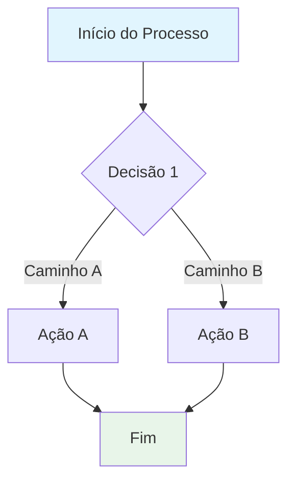

# Template: Documentação de Regras de Negócio — Módulo Fiscal/Financeiro

> **Versão:** 1.0.0 | **Autor:** [Seu Nome] | **Licença:** [MIT / Proprietária]
> 
> Template para mapeamento de regras fiscais/financeiras complexas em sistemas ERP Enterprise.

---

## 1. Contexto de Negócio

[Descreva o domínio fiscal/financeiro coberto por este documento.]

> [!IMPORTANT]
> [Alerta sobre risco de não conformidade, multas ou impacto regulatório.]

---

## 2. Diagrama de Fluxo



---

## 3. Matriz de Regras de Validação

| ID da Regra | Nome | Gatilho | Algoritmo / Fórmula | Status |
|:---|:---|:---|:---|:---:|
| **REG-001** | [Nome da regra] | [Quando dispara] | [Fórmula ou lógica] | ✅ Ativo |
| **REG-002** | [Nome da regra] | [Quando dispara] | [Fórmula ou lógica] | ✅ Ativo |

---

## 4. Notas Críticas de Arquitetura

> [!WARNING]
> [Decisão arquitetural com impacto direto em performance, consistência ou compliance.]

### 4.1. [Título da nota]

[Explicação técnica com exemplo de código se relevante.]

```java
// Exemplo de código
```

---

## 5. Checklist de Validação para QAs

- [ ] Todos os IDs de regra possuem casos de teste automatizados
- [ ] Testes de idempotência passam em 100% das execuções
- [ ] [Outro critério específico do domínio]

---

## 6. Referências Normativas

| Legislação | Descrição | Link Oficial |
|:---|:---|:---|
| [Lei/IN/Convênio] | [Descrição] | [URL] |

---

> **Documento preparado por:** [Seu Nome] | [Seu LinkedIn]
